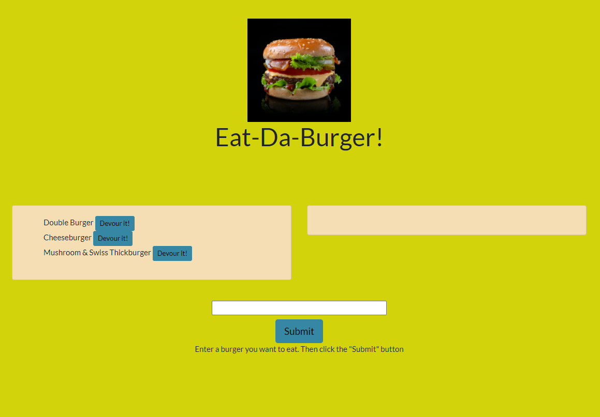

# Eat-Da-Burger!

## Description

My assignment was to create a burger logger with MySQL, Node, Express, Handlebars and a homemade ORM (yum!). I had to  follow the MVC design pattern; use Node and MySQL to query and route data in the app, and Handlebars to generate HTML.

## Screenshots

The following images show the web application's appearance and functionality: 



## Installation

```
npm init --y
npm i express
npm i express-handlebars
npm i mysql
```

## Deployment

The demonstration of the application functionality can be available by clicking on [deployed application](https://eat-da-yummy-burger.herokuapp.com/)